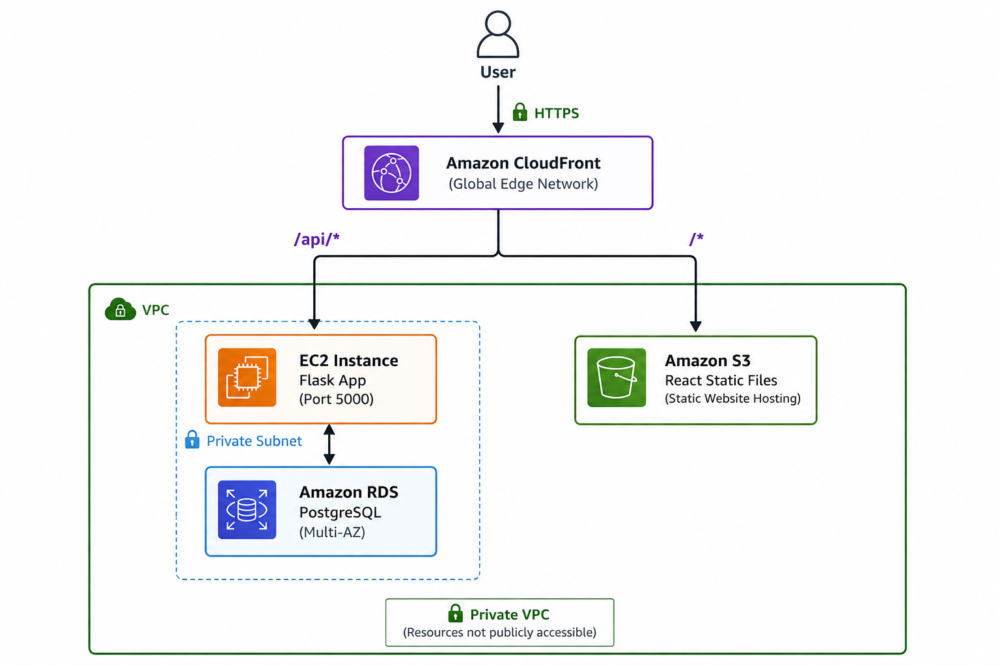
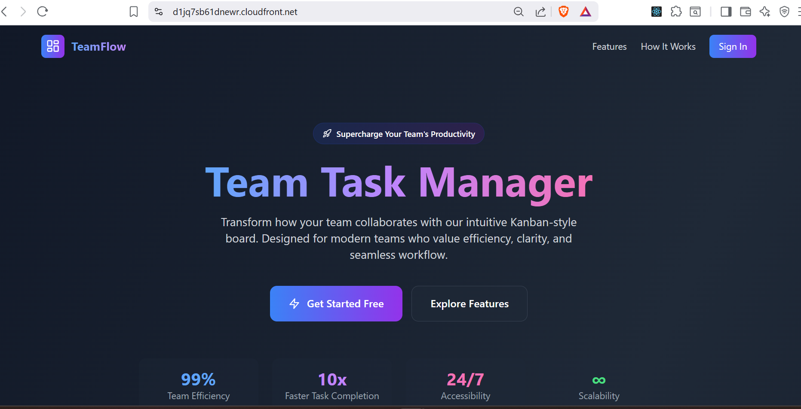
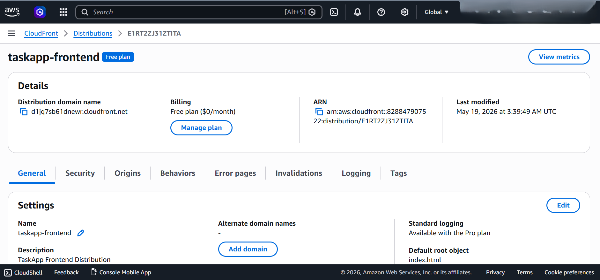
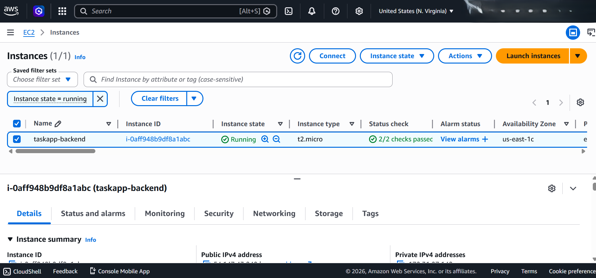
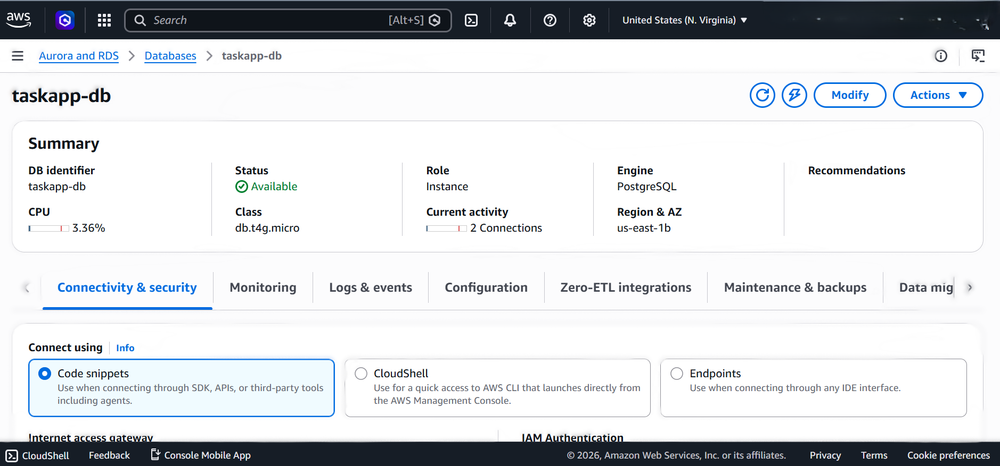
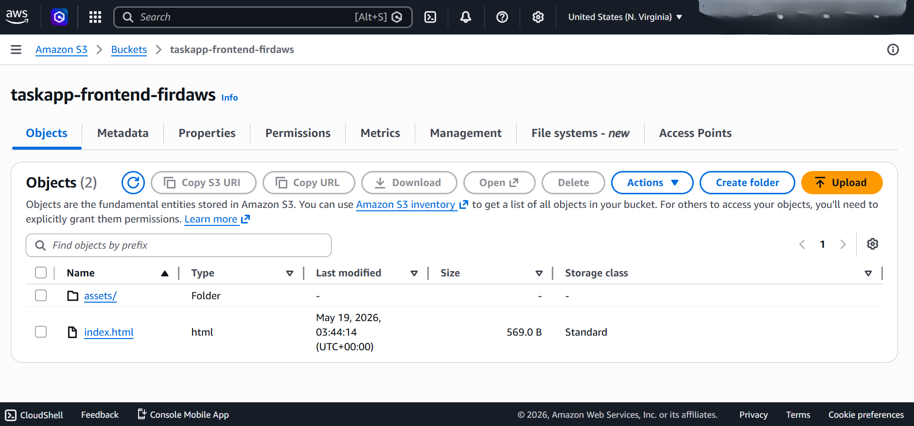
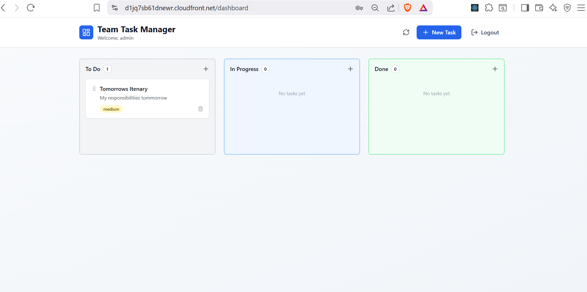

# TeamFlow Deployment — AWS Full Stack Architecture


---

## Overview

This repository documents the end-to-end deployment of a full-stack web application (**TeamFlow Task Manager**) on AWS using a real-world production deployment architecture.

The project was completed as part of the **TS Academy DevOps Programme** and demonstrates practical skills in:

- Cloud infrastructure provisioning
- Linux server administration
- Secure backend deployment
- Static frontend hosting
- CDN configuration and API routing
- Production debugging and troubleshooting
- AWS networking and security configuration

---

## Architecture



### Architecture Flow

1. Users access the application through Amazon CloudFront over HTTPS
2. CloudFront serves the React frontend hosted in Amazon S3
3. API requests (`/api/*`) are routed to the Flask backend running on EC2
4. The backend communicates securely with a private PostgreSQL RDS instance
5. Security Groups restrict database access to the EC2 instance only

### Services Used

| Service | Purpose |
| --- | --- |
| Amazon EC2 (Ubuntu 22.04) | Hosts Flask REST API backend |
| Amazon RDS (PostgreSQL) | Managed private relational database |
| Amazon S3 | Hosts static React production build |
| Amazon CloudFront | CDN, HTTPS termination, and API reverse proxy |
| VPC Security Groups | Network-level access control between services |

---

## Tech Stack

### Backend

- Python 3.12
- Flask 3.0
- Flask-SQLAlchemy
- Flask-CORS
- PyJWT (Authentication)
- psycopg2 (PostgreSQL driver)
- Gunicorn (installed, not used in this deployment)

### Frontend

- React 18
- TypeScript
- Vite
- Tailwind CSS

### Database

- PostgreSQL (Amazon RDS)

---

## Security Design

- RDS is **not publicly accessible** and remains private within the VPC
- EC2 SSH access restricted to a specific IP address
- CloudFront enforces HTTPS for frontend traffic
- Backend credentials managed using environment variables
- JWT authentication used for protected API routes
- Security Groups control service-to-service communication
- CORS configured for controlled frontend access

---

## Live Deployment URLs

| Component | URL |
| --- | --- |
| Frontend (CloudFront) | <https://d1jq7sb61dnewr.cloudfront.net> |
| Backend (EC2) | http://\<EC2_PUBLIC_IP\>:5000 |
| Database (RDS) | Private (VPC-only access) |

> Note: Infrastructure was decommissioned after project completion to avoid ongoing AWS charges.

---

## Deployment Screenshots

### Frontend UI



### CloudFront Distribution



### EC2 Backend Instance



### RDS Database Configuration



### S3 Bucket Objects



### Successful Application Login



---

## Repository Structure

```text
teamflow-deployment/
├── README.md
├── LICENSE
│
├── architecture/
│   └── README.md
│
├── backend/
│   ├── setup.sh
│   └── run.py.patch
│
├── frontend/
│   ├── build-steps.md
│   └── .env.production.example
│
├── infrastructure/
│   ├── s3-bucket-policy.json
│   └── security-groups.md
│
├── docs/
│   ├── deployment-guide.md
│   └── troubleshooting.md
│
└── screenshots/
    ├── architecture-diagram.png
    ├── cloudfront-distribution.png
    ├── ec2-instance-running.png
    ├── frontend-ui.png
    ├── rds-database-config.png
    ├── s3-bucket-objects.png
    └── successful-login.png
```

---

## Key Engineering Concepts Demonstrated

- AWS multi-tier architecture deployment
- Separation of frontend, backend, and database layers
- CDN-based frontend delivery with CloudFront
- Reverse proxy API routing using CloudFront behaviors
- Environment-based application configuration
- Network security using VPC Security Groups
- Production debugging and root cause analysis
- Cloud resource lifecycle management and cost awareness

---

## Lessons Learned

- Environment variable loading order can affect backend connectivity
- CloudFront caching requires explicit invalidation after deployment updates
- Mixed Content errors occur when HTTPS frontends call HTTP backends
- Security Groups are critical for inter-service communication
- Proper infrastructure separation improves scalability and maintainability
- Effective cloud debugging requires systematic isolation of components

---

## Future Improvements

- Containerize the backend using Docker
- Deploy containers with Amazon ECS
- Implement CI/CD using GitHub Actions
- Use Terraform for Infrastructure as Code (IaC)
- Integrate AWS Secrets Manager for credential management
- Configure Route53 custom domains and SSL certificates
- Replace Flask development server with Gunicorn + Nginx
- Automate full deployment workflows

---

## Source Repositories

| Component | Link |
| --- | --- |
| Backend | <https://github.com/ts-a-devops/taskapp_backend> |
| Frontend | <https://github.com/ts-a-devops/taskapp_frontend> |

---

## License

This project is intended for educational and portfolio purposes.

